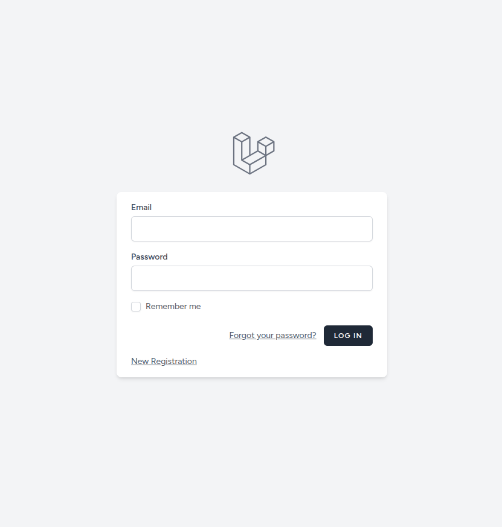
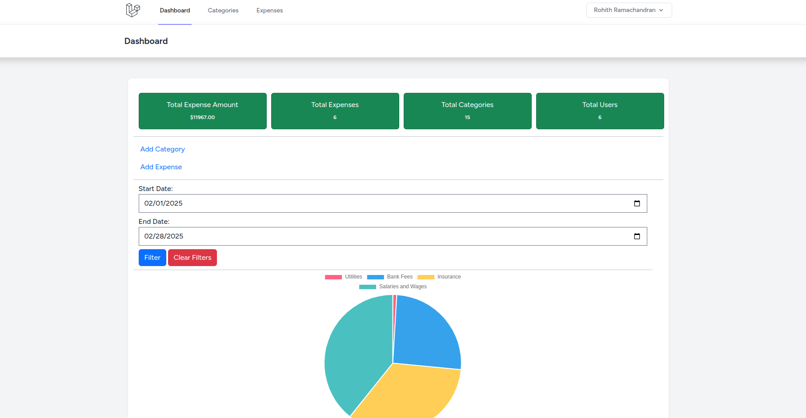
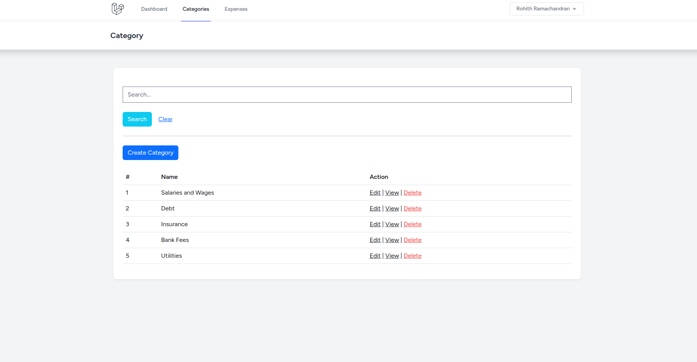
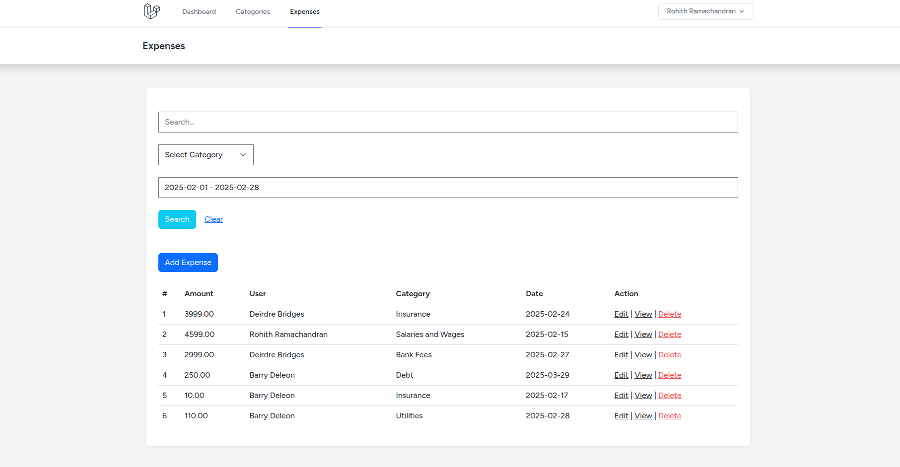
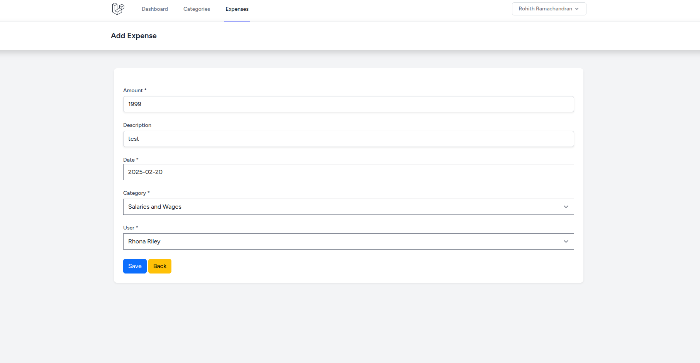

# Expense Tracker Application

- User '/' or '/login' to login the application
- Use '/register' to access the application as a user

## installation

- clone the repository
- run `composer install`
- run `npm install && npm run dev`
- connect database via .env
- run `php artisan key:generate`
- run `php artisan migrate` to load the schema
- run `php artisan db:seed` to load dummy data for users and categories (if needed)
- run `php artisan serve`

## Screenshots

- Login Page

- Dashboard

- Categories List

- Expense List 

- Expense Form

